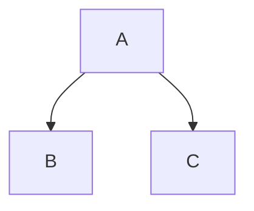

以下是一份**最全的 Markdown 常用语法**清单，涵盖基础语法、扩展语法（GitHub Flavored Markdown、其他增强语法）以及一些实用技巧。每个语法都附有示例和说明，方便你快速查阅。

---

## 总结速查表

| 用途 | 语法 |
|------|------|
| 标题 | `#` ~ `######` |
| 粗体 | `**文本**` |
| 斜体 | `*文本*` |
| 删除线 | `~~文本~~` |
| 链接 | `[文本](url)` |
| 图片 | `` |
| 无序列表 | `- 项目` |
| 有序列表 | `1. 项目` |
| 任务列表 | `- [ ]` / `- [x]` |
| 引用 | `> 内容` |
| 行内代码 | `` `code` `` |
| 代码块 | ` ```lang ` |
| 水平线 | `---` |
| 表格 | 用 `\|` 和 `-\|-` 绘制 |
| 脚注 | `[^1]` |
| Emoji | `:名称:` |
| 转义 | `\` |

---

## 1. 标题（Headings）
使用 `#` 符号，共六级。
```markdown
# 一级标题
## 二级标题
### 三级标题
#### 四级标题
##### 五级标题
###### 六级标题
```
**效果**：（不同渲染略有差异，但会逐级变小/变细）

# 一级标题  
## 二级标题  
### 三级标题  

---

## 2. 段落与换行（Paragraphs & Line Breaks）

- **段落**：连续两行文本之间空一行。
- **换行**：行末加两个空格 → 换行。  
  或者使用 `<br>` HTML标签。

```markdown
这是第一段。（末尾无空格）
这是第二段？

这是第三段（空行分隔）

行末两个空格  
换行成功
```

---

## 3. 强调（Emphasis）

| 语法 | 说明 | 示例 |
|------|------|------|
| `*斜体*` 或 `_斜体_` | 斜体 | *斜体* |
| `**粗体**` 或 `__粗体__` | 粗体 | **粗体** |
| `***粗斜体***` | 粗斜体 | ***粗斜体*** |
| `~~删除线~~` | 删除线（GFM） | ~~删除线~~ |
| `==高亮==` | 高亮（部分扩展，如 `<mark>`） | ==高亮文字== |

---

## 4. 列表（Lists）

### 无序列表
使用 `-`、`+` 或 `*`，可嵌套（缩进 2 或 4 个空格）。
```markdown
- 项目1
  - 子项目1.1
    * 更深一层
- 项目2
```

### 有序列表
使用 `1.` `2.` `3.`，数字可任意，渲染会重新排序。
```markdown
1. 第一步
2. 第二步
   3. 2.1
   4. 2.2
5. 第三步
```

### 任务列表（GFM）
```markdown
- [x] 已完成任务
- [ ] 未完成任务
- [ ] 带子任务
  1. [ ] 子任务1
  2. [x] 子任务2
```

---

## 5. 链接（Links）

### 行内链接
```markdown
[显示文本](https://example.com "可选标题")
```

### 参考式链接
```markdown
[显示文本][标签]
[标签]: https://example.com "标题"
```

### 自动链接
```markdown
<https://example.com>
<email@example.com>
```

### 内部锚点（通过HTML）
```markdown
[跳转到标题](#标题)
```

---

## 6. 图片（Images）

```markdown

```
也可以使用参考式：
```markdown
![替代文本][图片标签]
[图片标签]: 图片URL
```

---

## 7. 引用（Blockquotes）

```markdown
> 这是一个引用块。
> 可以跨多行。
>
> > 嵌套引用
```

**效果**：

> 这是一个引用块。
> 可以跨多行。
>
> > 嵌套引用

---

## 8. 代码（Code）

### 行内代码
用反引号 `` ` `` 包裹：
```markdown
这是 `printf("Hello")` 函数。
```

### 代码块
**方法1：三个反引号 + 语言标识**（推荐）
````markdown
```python
def hello():
    print("Hello, World!")
```
````

**方法2：缩进四个空格或一个制表符**（但不显示语法高亮）
```markdown
    def hello():
        print("Hello")
```

**方法3：三个波浪线 `~~~`**（部分解析器支持）

---

## 9. 水平线（Horizontal Rules）

以下三种任选（单独一行）：
```markdown
***
---
___
```

---

## 10. 表格（Tables，GFM）

使用竖线 `|` 和连字符 `-` 绘制，`:` 控制对齐。

```markdown
| 左对齐 | 居中对齐 | 右对齐 |
| :----- | :------: | -----: |
| 单元格1 | 单元格2 | 单元格3 |
| 长内容   | 也OK     | 自动调整 |
```

**效果**：

| 左对齐 | 居中对齐 | 右对齐 |
| :----- | :------: | -----: |
| 单元格1 | 单元格2 | 单元格3 |
| 长内容   | 也OK     | 自动调整 |

---

## 11. 转义字符（Escaping）

使用反斜杠 `\` 转义Markdown元字符：
```markdown
\*不是斜体\*
\# 不是标题
```

---

## 12. 内嵌HTML

大部分 Markdown 解析器支持直接写 HTML 标签，例如：
```markdown
<span style="color:red">红色文字</span>
<br>
<div>块级元素</div>
```

---

## 13. 扩展/增强语法

### 脚注（Footnotes）
```markdown
这是一个带脚注的句子[^1]。

[^1]: 脚注内容。
```

### 定义列表（Definition Lists，某些扩展）
```markdown
术语
: 定义内容
```

### 删除线（已在强调中列出）
### 自动邮箱链接
`<user@example.com>` → <user@example.com>

### Emoji 表情（GFM）
```markdown
:smile: :heart: :python: （部分平台支持代码表情）
```
直接复制 Unicode 表情也可以：😊❤️

### 上标/下标（需HTML或扩展）
```markdown
H<sub>2</sub>O      <!-- 下标 -->
x<sup>2</sup>       <!-- 上标 -->
```

### 任务列表中嵌套列表（已见）
### 警告框 / Admonitions（部分扩展如 MkDocs）
```markdown
!!! note "注意"
    这是一个提示框。
```

---

## 14. 图表（Mermaid，需解析器支持）

````markdown

````

---

## 15. 数学公式（LaTeX，需渲染器支持，如 MathJax）

```markdown
行内公式：$E = mc^2$

块级公式：
$$
\int_a^b f(x)\,dx = F(b)-F(a)
$$
```

---

## 16. 目录（TOC，部分扩展自动生成）

某些平台支持 `[TOC]` 生成标题目录。

---

## 17. 键盘按键（GFM 样式）

```markdown
<kbd>Ctrl</kbd> + <kbd>C</kbd>
```
效果：<kbd>Ctrl</kbd> + <kbd>C</kbd>

---

## 18. 嵌套混合使用

几乎所有语法可以互相嵌套，但注意有的需要留空行：
```markdown
> 1. 引用的有序列表
>    - 嵌套无序
>    - 代码 `inline`
> 
> > 嵌套引用
```

---
