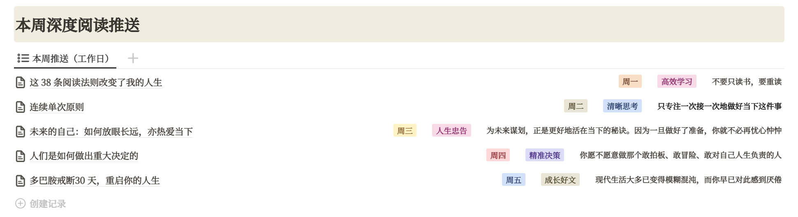

## 目录

[为什么要做专注认知提升的知识库](#为什么要做专注认知提升的知识库)
[认知快充阅览室的核心功能](#认知快充阅览室的核心功能)
[如果您还是不确定从哪里开始，我们建议：](#如果您还是不确定从哪里开始，我们建议：)

## 如何更好的使用认知快充阅览室

欢迎加入 认知快充阅览室！

感谢您选择和我们一起通过多维度且深度的内容，构建自己的认知体系。

我们为您提供

250+篇推送 来自海外顶级大咖，以及专业期刊等多个权威领域的优质深度内容，系统、持续、多维的培养深度阅读的习惯。

内容涵盖商业变现、社会规律、人性真相、工作效率、思维逻辑、创业副业、经营管理等领域。

支持多端同时登录的认知知识库，电脑/平板/手机/等多端阅读，随时随地高效学习，可阅读、听、下载。

### 为什么要做专注认知提升的知识库

很多普通家庭出身，或者刚进入社会，以及在职场中混迹了很多年的普通人，往往都面临着一个普遍的困境，那就是成熟得晚，对社会的洞察和人性的认知严重不足。 

从小就被灌输“穷人家的孩子早当家”，努力致富的思想，所以在生活和工作中也格外的重视脚踏实地。 但大学毕业后才发现，原来大学只是把我们暂时聚在了一起，毕业之后我们都回到了自己本该呆着的阶层。

慢慢发现要想有所建树，拼的不只是学历，还有你的原生家庭的托举，以及你对这个世界的认知。 

成长最快的方式是建立自己的知识体系，同理认知体系也可以通过系统的阅读打造。

很多能接触到的内容看似有道理，实则太碎片化了，虽然有用，但是凌乱的知识体系很难串联起来。而真正有效的学习，是要以优质的信息源为基础的。

而认知又是一个很大的话题，不同的人都有不同的理解，可以是人性认知、社会认知、商业认知、阶层认知、效率认知、甚至懂了一个道理也算提升了认知。

所以认知提升的核心都是通过阅读，且一定是大量且深度的阅读，才能从根本上构建系统的认知框架。

而这个知识库的核心目的：就是编译和策展一些在未来3-5年甚至很长一段时间有价值的深度内容，让你在阅读中找到对这个世界的理解，以及自己人生的方向，并不断的打造自己的认知体系。

### 认知快充阅览室的核心功能

面对这么庞大的知识库，初来乍到的朋友可能会茫然：这么多长文，我应该看什么，从哪里开始看？

我们只做 3 个核心功能：

#### 1、系统化的输入【每周】：工作日每天推送一篇海外深度内容

您可以在会员群接收内容，如果群内内容或者PDF文件下载过期，点击知识库主页往期日推进入即可。

#### 2、专题式的输出【每月】：围绕一个认知专题进行系统化阅读

你可以从阅读每月的专题内容，也可以在知识库主页往下滑，找到「月度专题」学习板块进入

#### 3、深度打造认知体系的知识库

所有内容精细归类、标记与可检索。

你可以从页面的左上角🔍搜索内容，也可以通过知识库主页「认知母题计划、商业认知、思维模型、顶级大咖、多维认知、成长疗愈」几大板块，进入你想了解的领域进行阅读。

其中各大板块的基本标签如下：

认知母题计划：思维重构、底层认知、高效学习、决策规划、行动与习惯、人生忠告、职业规划、社会真相、宏观认知、精力管理

商业认知：营销思维、内容营销、营销转化、品牌营销、管理思维、管理经验、自我管理、公司经营、创业思维、产品思维、YC创业课

思维模型：通用思维模型、数理思维模型、系统思维模型、生物学思维模型、人性与决策心理模型、经济学思维模型

顶级大咖：收录了海内外顶级商业大咖的思考、演讲、语录等内容

多维认知：财富思维、创业副业、投资理财、个人成长、大咖思维、阶层跃迁、社会规律、人性真相、原生家庭、人际关系

成长疗愈：自我提升、关于焦虑、压力管理、关于睡眠、正念冥想、冥想音频、心理专题

### 如果您还是不确定从哪里开始，我们建议：

内容有八个大模块，下面有很多细分模块； 您先看下哪些模块比较感兴趣，以自身兴趣切入； 如果平时阅读量少； 可以先看多维认知的模块入门，再接着看认知母题计划，顶级大咖这些； 如果平时阅读比较多的话，根据您的节奏阅读即可； 平时上班如果不是很忙，用电脑的话可以用网页版登录学习方便些； 通勤可以用手机阅读或者听音频都是可以的； 另外每个工作日会在日推群推送内容的哟~

——认知快充团队 编辑