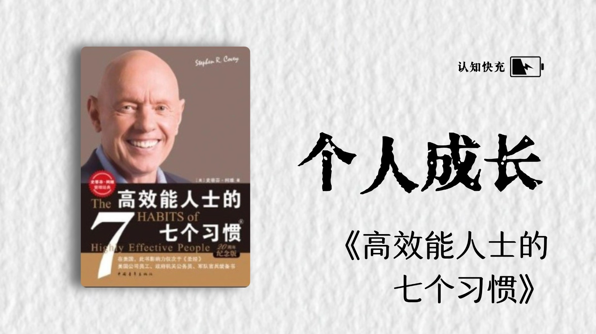

## 目录

[阅读摘要：](#阅读摘要：)
[史蒂芬·柯维（Stephen R. Covey）简介](#史蒂芬·柯维（stephen-r.-covey）简介)
[书籍下载：](#书籍下载：)

### 阅读摘要：

《高效能人士的七个习惯》（"The 7 Habits of Highly Effective People"）是由史蒂芬·柯维（Stephen R. Covey）所著的一本个人成长和领导力发展的书籍。这本书自1989年首次出版以来，一直被认为是个人和职业发展领域的经典之作。以下是这本书中提到的七个习惯的简要摘要：

1、积极主动（Be Proactive）：主动承担责任，不把问题归咎于外部环境，而是通过自己的行动来影响结果。

2、以终为始（Begin with the End in Mind）：明确自己的目标和愿景，然后根据这些目标来规划和行动。

3、要事第一（Put First Things First）：优先处理最重要的任务，而不是被紧急但不重要的事情所干扰。

4、双赢思维（Think Win-Win）：在人际关系和交易中寻求双方都能接受的结果，而不是单方面的胜利。

5、知彼解己（Seek First to Understand, Then to Be Understood）：在沟通中先努力理解对方，然后再表达自己的观点。

6、统合综效（Synergize）：通过团队合作和协作，创造出比个人单独工作时更大的价值。

7、不断更新（Sharpen the Saw）：持续地在身体、精神、智力和社会/情感四个方面进行自我更新和成长。

这本书强调了个人责任、自我意识、自我管理以及与他人的关系管理，旨在帮助读者在个人和职业生活中取得成功。每个习惯都包含了更深层次的原则和实践，旨在引导读者实现更高效和有意义的生活。

### 史蒂芬·柯维（Stephen R. Covey）简介

史蒂芬·柯维是美国著名的管理学大师、思想家和领导力专家。他是《高效能人士的七个习惯》一书的作者，该书自出版以来，在全球范围内产生了深远的影响，被广泛认为是一部经典的自我提升和管理著作。

柯维博士曾在美国杨百翰大学获得商业管理博士学位，他在教育、企业管理和个人成长等领域拥有丰富的经验和深厚的造诣。他的思想和理念不仅在商业领域得到广泛应用，也对个人的生活和职业发展产生了积极的指导作用。

柯维博士一生致力于帮助人们提升领导力和效能，他的其他著作还包括《要事第一》等。他的理念和方法被众多组织和个人所采纳，对推动个人和社会的进步发挥了重要作用。

### 书籍下载：

EPUB：

史蒂芬·柯维 - 高效能人士的七个习惯（30周年纪念版）_打造一套全新的思维方式和原则体系（经典著作，附赠个人效能PEQ在线测评） (2018, ：北京中青文文化传媒有限公司).epub

5.8MB

PDF：

史蒂芬·柯维 - 高效能人士的七个习惯（30周年纪念版）_打造一套全新的思维方式和原则体系（经典著作，附赠个人效能PEQ在线测评） (2018, ：北京中青文文化传媒有限公司).pdf

6.4MB

MOBI：

史蒂芬·R·柯维 - 高效能人士的七个习惯•25年企业培训精华录_管理精要+执行精要+领导力精要(套装共3册) (高效能人士的七个习惯·25年企业培训精华录) (2014, 万千书友聚集地).mobi

6.2MB

