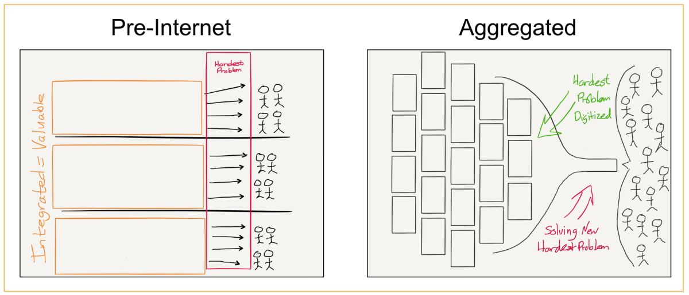

#聚合理论 #重构价值 

## 目录

[导读](#导读)
[正文](#正文)

#### 导读

内容概要：本文系统梳理了“聚合理论”（Aggregation Theory）的核心观点，并通过多个典型行业的案例说明了互联网如何重构传统价值链，将“控制分销”的优势转变为“控制用户体验”的主导权。文章由Stratechery 创始人Ben Thompson所写，是理解数字时代商业模式变革的重要理论基础。

推荐理由：在商业战略制定中，理解“价值是如何在价值链中迁移的”至关重要。聚合理论为创业者和管理者提供了一个清晰的分析框架，解释了为何谷歌、亚马逊、Netflix、Airbnb等企业能在颠覆既有秩序中获得垄断性地位。这不仅是一个关于技术的故事，更是关于用户关系、市场重构与战略优势迁移的深度洞察。

### 正文

Stratechery 最近的几篇文章，恰好无意间构成了一个理论系列：

《Airbnb 与互联网革命》探讨了 Airbnb 和共享经济如何将“信任”商品化，从而催生出一种以资源聚合和客户关系管理为核心的新型商业模式。

《Netflix 与“有吸引力的利润守恒”》则将这种商品化/聚合机制纳入克莱顿·克里斯坦森提出的“有吸引力的利润守恒”（Conservation of Attractive Profits）理论中，指出价值链中的利润会从现有企业向那些成功实现模块化和价值链重构的企业转移。

《网页为何如此糟糕》虽聚焦于程序化广告对网页性能的影响，但其结论也揭示出：广告网络对出版商的“商品化”正是“有吸引力利润”理论的延伸表现。

回顾这些内容，一条清晰的主线跃然纸上。实际上，这不仅贯穿了最近的几篇文章，更几乎贯穿了Stratechery 的全部写作主张。我将其称为：聚合理论（Aggregation Theory）。

在任何特定的消费市场中，价值链大致可以划分为三部分：供应商、分销商和消费者/用户。若想在这一链条中获取超额利润，最理想的方式要么是在某一环节形成横向垄断，要么整合其中两个环节，从而在垂直整合中占据优势。在互联网出现之前，这种优势通常依赖于对“分销”的控制。

举例来说，在某一地理区域内，报纸印刷是向消费者传递内容的主要渠道，因此报纸企业通常会向上游延伸至内容创作（即供应端），并依靠广告获得超额利润。类似逻辑也存在于图书出版（掌控发行与作者关系）、视频媒体（结合播放渠道与内容采购）、出租车行业（调度系统与车牌/车辆所有权）、酒店行业（品牌信任与房源供给）等多个领域。注意，这些行业的分销商往往向供应端整合，这是因为在一个交易成本高昂的时代，掌控供应关系能带来更强的议价权。

而互联网则从根本上颠覆了这一结构。

首先，互联网使得数字商品的分销成本降为零，削弱了原本“控制分销即掌控市场”的优势；其次，互联网几乎消除了用户与分销平台之间的交易成本，这使得企业可以直接与消费者大规模整合。

这场变革重塑了商业竞争的根本逻辑： 企业不再通过绑定供应商来获取竞争优势，消费者也不再是最后才被考虑的角色。相反，供应端变得可以被商品化，而用户关系成为一切的起点。最终形成的竞争核心，是谁能提供最佳用户体验。

最优秀的分销商/聚合者/市场组织者，往往依靠用户体验赢得用户，继而吸引供应商加入，从而形成良性循环，进一步提升用户体验——也就构建了强大的竞争壁垒。

最终的结果正如“有吸引力利润守恒定律”所预示的那样：价值将从原本向后整合的企业流向聚合者，因为聚合者能将模块化的供应资源整合到用户一端，并建立规模化的排他关系。具体表现如下：

谷歌 以往出版商将报纸与文章内容整合，谷歌将其模块化，使得用户可通过搜索直接访问单个网页或文章。谷歌再将这些搜索结果与用户行为和个人资料整合，从而销售极具效率的广告。

Facebook（广告及网络） 传统出版商将内容与广告打包出售，而Facebook将广告单独模块化，让广告主可直接锁定特定用户。Facebook通过将新闻流广告库存与个人画像整合，大幅提升广告投放效率。

亚马逊 图书出版商曾掌控编辑、营销与发行全链条，亚马逊则通过电商和电子书实现分销模块化，再将用户数据与支付系统整合，构建起庞大的出版生态。

Netflix 传统电视网络整合内容购买与播放频道，Netflix将播放时段模块化，允许用户在任意时间、任意顺序观看任何内容。通过将内容采购与客户管理结合，Netflix建立起订阅增长与内容投资的正向循环。

Snapchat 传统电视面向大众市场投放广告，Snapchat模块化吸引了用户注意力。通过将个性化内容与广告库存相结合，为品牌广告商提供精准触达的解决方案。

优步（Uber） 传统出租车公司将调度系统与车辆运营合并，而Uber则通过吸纳独立司机将车辆运营模块化，并整合调度与客户关系，实现全球扩张。

Airbnb 传统酒店以品牌构建信任并控制房源，Airbnb则通过信任机制（用户评价系统）模块化控制房源，并整合物业与客户管理，打造出全球规模的平台。

仔细观察这些案例的排序也颇有意味。谷歌是最早的“聚合者”，将内容提供者模块化这种模式容易成功，因为内容本就可以通过代理实现商业化，比如为报纸或CD付费。而数字化的出现，则揭露了这些代理结构的冗余。

相比之下，Facebook的聚合模式更为强大：它的“供应商”就是用户本身。虽然同样是聚合免费内容，但Facebook拥有对这些内容的排他访问权。Snapchat及其他UGC网络也遵循类似路径。

更进一步的是 Airbnb 和 Uber 这类案例： 它们不再局限于数字内容，而是将线下资产（房间、车辆）数字化，并成功实现商品化。这背后的关键，是它们极致优化的用户体验。而这正是传统企业长期忽视的环节。

从现实来看，虽然Uber和Airbnb的供应商在理论上是开放的，但由于平台规模与效率带来的“正反馈机制”，它们事实上已逐渐实现排他。这进一步加固了它们作为“聚合者”的壁垒。

上述所有案例都有一个共同点：强烈的“赢家通吃”效应。

这些平台不仅服务于全球用户，而且用户越多，平台服务越好，反过来又吸引更多用户。这种动态优势，正是消费科技公司在资本市场备受推崇的原因。

展望未来，我相信“聚合理论”将成为理解初创企业机会和传统企业威胁的关键分析框架：

赢得用户体验的企业将构建起正向循环，通过掌控用户关系来吸引供应商，从而进一步增强用户体验。

像 Uber 和 Airbnb 的案例尤为具有象征意义： 它们颠覆的并非纯粹的数字内容，而是传统、尚未数字化的实体资源。我相信，未来几乎每一个行业，最终都会发现自己拥有一个可以被数字化、被商品化的核心职能，从而完成向聚合时代的转变。

互联网革命才刚刚开始，而“聚合理论”，正是这场变革的关键路径。

