## 目录

[造假币者即奴役者](#造假币者即奴役者)
[市场、主权与道德](#市场、主权与道德)
[所谓主权国家](#所谓主权国家)
[吉萨大金字塔](#吉萨大金字塔)
[时间窃贼](#时间窃贼)
[现代奴隶主](#现代奴隶主)
[逐光而行](#逐光而行)

金钱是交换人类时间的工具。作为现代社会的金钱主宰者，中央银行将这个工具当作武器，窃取时间并加剧财富不平等。历史告诉我们，货币体系的腐败会导致道德沦丧、社会崩溃和奴役状态。由于人类始终无法抵抗操纵金钱的诱惑，唯一的解药就是永不腐化的货币——比特币。

### 造假币者即奴役者

"知识使人不适合成为奴隶。"——弗雷德里克·道格拉斯

在古代西非地区，一种名为 阿格里彩珠(aggry beads) 的装饰性小玻璃珠被用作货币长达数百年。这些来源不明的珠子既是贸易往来中的财富媒介（作为货币），也是代际传承的财富载体（充当嫁妆或传家宝）。16 世纪欧洲探险家抵达非洲时，他们立刻注意到当地人对阿格里彩珠的高度重视。由于当时非洲玻璃制造技术落后，这种珠子产量稀少——相对于其他商品而言具有稳定的稀缺性，这种货币属性有效支撑了其市场价值。

回到欧洲后，玻璃制造技术更为先进；几乎与阿格里彩珠毫无二致的仿制品能以低廉成本大规模生产。精明的欧洲人迅速抓住商机，开始组织前往西非的远征，将欧洲玻璃工坊精心仿制的（真假难辨的）阿格里彩珠成船运往非洲。这场骗局成为人类历史上最早有记载的大规模货币造假行为之一。看似无害的玻璃珠出口贸易，最终演变成持续数十年的掠夺——非洲的财富、自然资源，乃至最宝贵的时间都被无情榨取。

当欧洲船只抵达非洲海岸时，许多船舱里装满了玻璃珠。当地人毫不犹豫地用自己辛苦积累的财富，换取他们眼中珍贵的阿格里彩珠。这场用真实资产换取假冒珠子的交易持续数十年，实则暗中完成了欧洲人对非洲财富的隐秘掠夺——这场慢动作的犯罪持续发酵，使非洲社会在未来几个世纪都难以恢复元气。阿格里彩珠后来被称为"奴隶珠"：当陷入赤贫的非洲人走投无路时，有些人被迫将自己或同胞卖作奴隶，落入欧洲掠夺者之手。这种由造假者操控的货币工具——奴隶珠，最终成为横跨三个世纪的大西洋奴隶贸易的重要推手。

历史充满野蛮的讽刺——那些满载(仿制)阿格里珠的船只刚在非洲靠岸，转头就装满了珍贵的人类货物驶向欧美大陆。奴隶船的船长们以非人道的精确度，将非洲奴隶如同当初用来购买他们的玻璃珠般，密密麻麻塞进船舱。

遗憾的是，这种财富掠夺并非孤立事件。布条是古代非洲使用的另一种货币形式，在与北方穆斯林商人长达数世纪的贸易往来中，它逐渐成为成熟的交易媒介。当地非洲部落很快开始生产这种俗称"帕诺斯"的布条，但葡萄牙人采用更高效的生产方式占据了竞争优势。随之形成了一种畸形的盈利模式：葡萄牙人用帕诺斯布条购买非洲奴隶，而这些奴隶被迫生产那些用来剥夺他们自由的布条。正如苏格兰历史学家克里斯托弗·法伊夫描述的这段可怕贸易关系：

"部分奴隶本就是专业织工，他们像在大陆时那样将棉花织成土布。葡萄牙人引入了北非风格的繁复花纹，从 16 世纪中叶起，佛得角群岛生产的帕诺斯布条就定期出口至几内亚地区，专门用于换取奴隶。"

受到近乎无限的利润潜力吸引，葡萄牙布匹生产商很快建立了由国家支持的垄断企业——格朗帕拉与马拉尼昂公司。该公司强制要求所有以布匹计价资金流必须使用其仓储和商栈设施，并强制规定使用布匹缴纳税款、签订奴隶贸易契约以及雇佣士兵。举个绝非巧合的当代类似案例：美国政府强制要求使用美元缴纳税收、作为法定货币、以美元为石油（现代社会的能源奴隶）贸易合约计价单位，并将其作为国际储备货币（即臭名昭著的"嚣张特权"）。

当前全球经济中正上演着与非洲珠和印花布惊人相似的一幕：你口袋里那张美元钞票，那个你付出巨大代价才获得的货币，最近被美国政府通过(几乎不费力的)键盘敲击大规模生产出来。正如欧洲人凭借优越的玻璃制造技术得以低成本伪造货币，或葡萄牙人垄断印花布生产那样，中央银行拥有近乎零成本印钞的特权，这使他们能够随意从所有美元使用者手中掠夺财富。尽管手段不那么显眼且表面温和，但当今央行实施的操作，与狡猾的欧洲人用来对付毫无戒心的非洲人的武器化盗窃手法如出一辙。

关于阿格里彩珠和帕诺斯布的人类行为历史给受中央银行体系困扰的社会上了重要一课：那些垄断货币生产的机构实质上就是永续窃取人类劳动的伪钞集团。当自由市场力量被操纵时，生产者便获得了罔顾消费者偏好的不对称定价权，从而将经济民主转变为独裁统治，将自由扭曲为暴政。就货币而言，这意味着垄断者能以不公平价格获取人类时间（即劳动力）。换言之：货币垄断者可以窃取人类时间——这种邪恶权力实际上使他们成为了奴隶主。

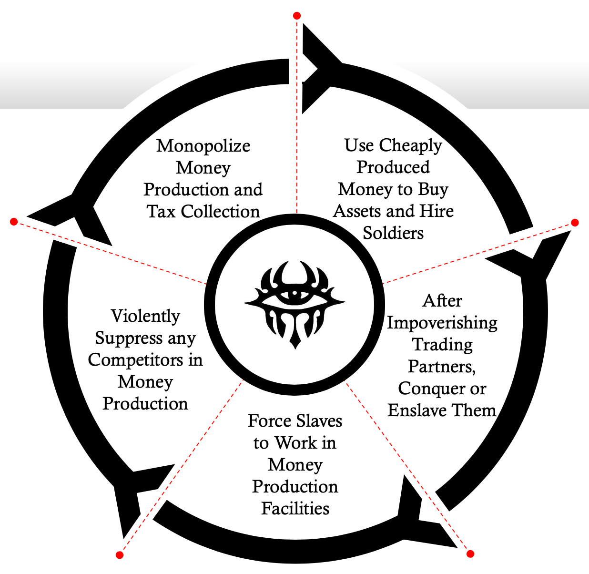

无视市场竞争压力而独占货币生产权，实为奴役工具——垄断者唯有通过欺骗与暴力才能维系这种卑劣特权。

假冒的 阿格里彩珠和 panos 是掠夺人类时间的武器；这些行为在 1501 至 1806 年间直接夺走了 1250 万人的生命（并间接窃取了他们的后代）。跨大西洋奴隶贸易是对非洲人的慢动作大屠杀：约 200 万人死于臭名昭著的"中途航线"，幸存者终其一生都在劳役中度过，或被迫生育以补充奴隶主的"库存"。从经济角度量化这场暴行（不计生而为奴者）：假设每个奴隶每年劳动 5000 小时、持续 40 年，被窃取的总时间高达 2.5 万亿（2,500,000,000,000）小时，相当于 365 年间每年被掠夺 6.8 亿小时

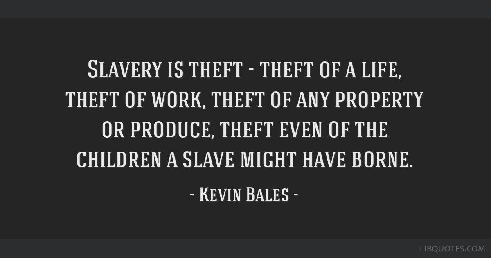

跨大西洋奴隶贸易是一场既骇人听闻又规模庞大的悲剧；倘若货币生产垄断权能面临自由市场竞争，这段人类历史的恐怖篇章就不会达到如此巨大的规模。在（非暴力）市场竞争中，生产者的行为由消费者偏好引导：这种动态机制推动着低价和技术创新。一旦缺乏这种制衡，生产者就会被激励不择手段扩大市场份额——甚至包括暴力胁迫。简而言之，市场压力使人保持诚信：正因如此，市场结构与道德准则相互交织。

### 市场、主权与道德

"「道德行为必须出于自由意志。」――穆瑞·罗斯巴德"

争是一种天然的筛选机制：在体育比赛中，我们通过单场比赛发现哪支队伍更具实力；在整个赛季中，反复较量则帮助我们找出整体表现最佳的队伍。在自由市场中，竞争就是一系列旨在发现"需求满足方案"的竞赛：每位企业家都押下"赌注"（投入资金、资源和时间），试图通过为客户提供更优质、更快捷或更经济的解决方案，在市场上证明竞争对手的错误。市场竞争是推动诚实劳动和文明真正进步的催化剂。正如美国实用主义者所言："真理是探究的终点"——从这个意义上说，自由市场可被视为持续探究、不断逼近真理的场所。那些在持续的企业家式拷问中存活下来的竞争理念，正是我们对真理的最佳近似——正如威廉·詹姆斯所说。

"任何能让我们驾驭的想法...任何能顺利引导我们从经验的一部分通向另一部分，令人满意地连接事物，稳妥运作，节省劳力的想法，在相应程度上就是真实的，就此而言是真实的，作为工具是真实的"

从实用角度看，真理往往与最有用的事物难以区分。在自由交换的平台上，真理以精准价格、实用工具和个人美德的形式呈现。价格动态反映了市场参与者对相对交换比率的共识，这是跨越无数交易决策得出的结果。一件实用性卓越的工具，凝聚着人类当前解决特定问题的最前沿智慧。换言之：当创业者通过实验探索现实本质时，他们打造的工具——以及构建这些工具的知识体系——会根据客户偏好不断调整，直到某个或某几个优选方案占据市场主导地位。美德与核心竞争力，则是那些在持续经济压力下仍能创造利润的成功创业者身上体现的特质。自由市场这种追求真理的机制具有天然的迭代性：价格、工具和美德都会根据市场状况持续演变。

在市场化探索游戏中，"积分"以货币形式计量——这种工具能最有效地用于核算、协商和执行交易。市场竞争是约束生产者诚信的机制：当它被强制手段或暴力压制时（比如"合法垄断"的情况），真相就会扭曲为失真的价格、劣质工具和个体堕落。对货币发行者而言，垄断意味着不诚实的生产者会变成伪钞制造者，从而获得对人类时间的（欺骗性和暴力性）支配权。

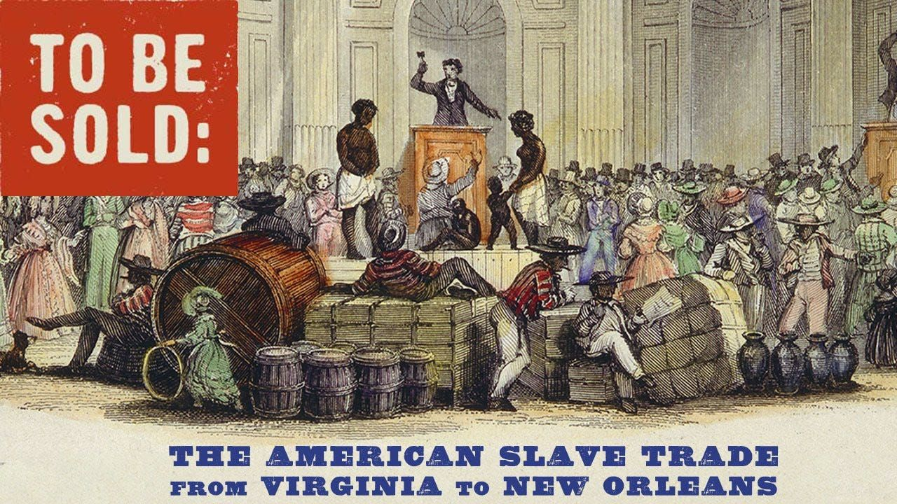

与传统观念相反，金钱并非"万恶之源"，它实际上只是交换时间（或劳动）的工具——是市场参与者在经济交易历史长河中相互传递付出与成就的媒介。和所有工具一样，金钱本身并不具备独立的道德属性。工具是非道德性的，这意味着它们既可用于善举也可用于恶行。使用工具产生的道德结果，完全取决于使用者的意图。金钱是时间交易工具，但（正如我们所见）它也可能被恶意利用来窃取时间，就像锤子既能盖房也能砸碎头骨那样。

更准确地说，金钱——连同其前身行动和言语——是"一切主权的根源"：即按照自己认为合适的方式在世界上行事的权威。主权（Sovereignty）这个词在词源上与君主制、金钱和皇室相关，指的是人类行动领域中至高权力的所在。根据自然法则，主权内在于个体之中，因为每个人都必须自觉决定采取何种行动，无论面临何种外部影响。主权的生成源泉存在于我们每个人内心——这是一种不可侵犯的理性原则，被称为逻各斯（logos）。作为秩序与混沌这两个主要经验领域之间的界面层，逻各斯是人性的决定性特征：我们讲述和相信故事的能力，正是人类区别于动物的关键。维克多·弗兰克尔将这个内在空间称为"人类最后的自由"。

"人类最后的自由：在任何特定环境下选择自己的态度，选择自己的道路。我们时刻都面临选择。每一天、每一小时都提供了决策的机会，这个决定将决定你是否会屈服于那些企图剥夺你本真自我和内心自由的力量；决定你是否会成为环境的玩物，放弃自由与尊严......"

从主权（sovereignty）一词衍生出'统治'（reign）这个词，通常指代君主统治时期。如今我们大多数人都生活在早已不再臣服于王室的年代，而我们对主权的文明认知也随着时间的推移不断去中心化，越来越清晰地反映出自然法则。正如乔丹·彼得森所描绘的这种历史进程：

"最初，唯有国王才是至高无上的统治者。后来贵族阶层获得了主权。接着全体男性都拥有了主权。随后基督教革命到来，每个独立的灵魂——这看似不可能——都成为了主权者。这种个人主权与价值理念，构成了我们法律和文化体系的核心前提。因此我们都秉持着这样的信念生活：每个人都如同神圣的理性中心。我们彼此给予尊重，承认每个公民都是独立主权者，在法律面前一律平等。"

当今西方文明的基石在于：个人主权高于国家权力——这一核心理念具体体现在人身保护令、'无罪推定'原则以及言论自由权等法律准则中。

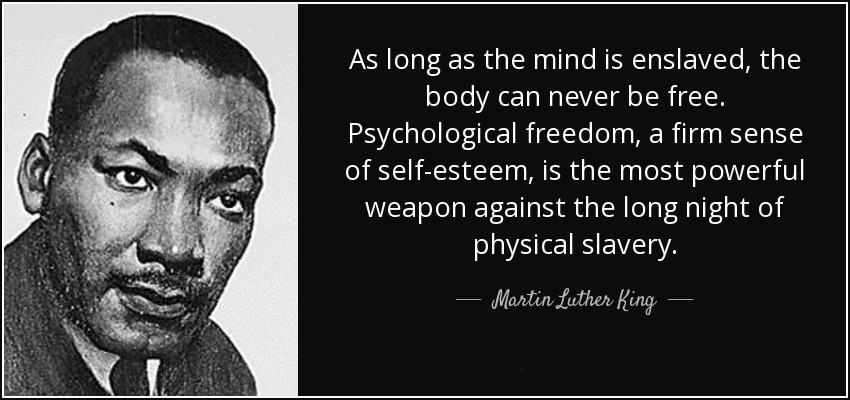

言论自由对和谐社会至关重要，因为思想必须能自由碰撞、化解冲突，才能避免肢体冲突。人类语言的产生直接源于进化发展：当我们的灵长类祖先直立行走后，视野得以扩展，双手因不再用于移动而更擅长改造自然环境。随着对生拇指的出现，我们发展出精细操作能力，能够以实用方式区分自然界——比如分类物品、计数和制造工具。与手部精密动作同步进化的是面部与舌头的精细肌肉，由此催生了口语。语言既补充了双手分类世界的能力，也强化了心智理解世界的能力（就连我们的内心独白也是由语言构成）。这种用手改造世界的能力，反过来又强化了我们用语言抽象描述世界的能力，从而在人类这两大特质间形成了动态反馈机制。 工艺技术与语言表达的协同发展自然催生了贸易，而在任何贸易社会中最具流通性的物品，往往就是其最重要的工具——货币。

由此观之，货币是行动与语言的直接衍生物：这三者都是主权自我表达的重要媒介。从这个意义上说，货币本身可视为一种特殊的语言——价值的语言。对这种语言使用的限制（央行存在的目的），其危害程度不亚于限制言论自由（这可能导致诸如"非法数字"之类的荒谬现象）。自由言论为专制掘墓，而压制言论则是极权政体的标志。事实上，所有野心家上台后的第一要务，永远是扼杀异议之声——遮蔽理性之光。二十世纪出现过诸多压制理性的独裁政权，我们仅举两例：

1917 年，俄国布尔什维克在十月政变次日就着手限制言论自由。他们颁布了《出版法令》，取缔所有"通过诽谤性歪曲事实来煽动不和"的报纸。同样，德国国家社会主义者在 1933 年上台仅数月后便开始焚书，宣传部随即实施了严格的审查制度。

逻各斯（Logos）是一个希腊词汇，意为"比例"或"言语"——作为人际沟通的核心法则，这种沟通主要通过言语和价格（即以货币形式表达的交换比率）来实现。言语与价格都是"范畴性比较工具"，它们是封装、对比并传递现实不同侧面的规范体系——神圣逻各斯的力量正源于此，能从混沌中建立秩序。在语言中，所有词汇都只有通过相互参照才有意义：每个定义都由其他词语构成。市场上，客观供给与主观需求的交汇点就是价格：这个动态数值反映了集体逻各斯对任意商品交换比率的共识（为简化表达，采用经济数字的通用语言：货币）。

为了金钱利益，政府通过不断破坏货币供应（通过通货膨胀）同时强制其需求（通过法定货币和税收法律），扭曲了比较表达的定价模式。这种对自然价格发现的干扰，实则是操纵集体理性，等同于歪曲民意——人民的声音。乔治·奥威尔曾说："如果自由真有什么意义，那就是告诉人们他们不愿听的事实权利。"无法说真话（用语言），或在市场中证明他人错误（用价格），就是自由的消亡；正如 20 世纪给我们的惨痛教训，限制理性表达是滑向极权主义的危险斜坡。一切形式的自由表达，都是正当道德行为的前提。

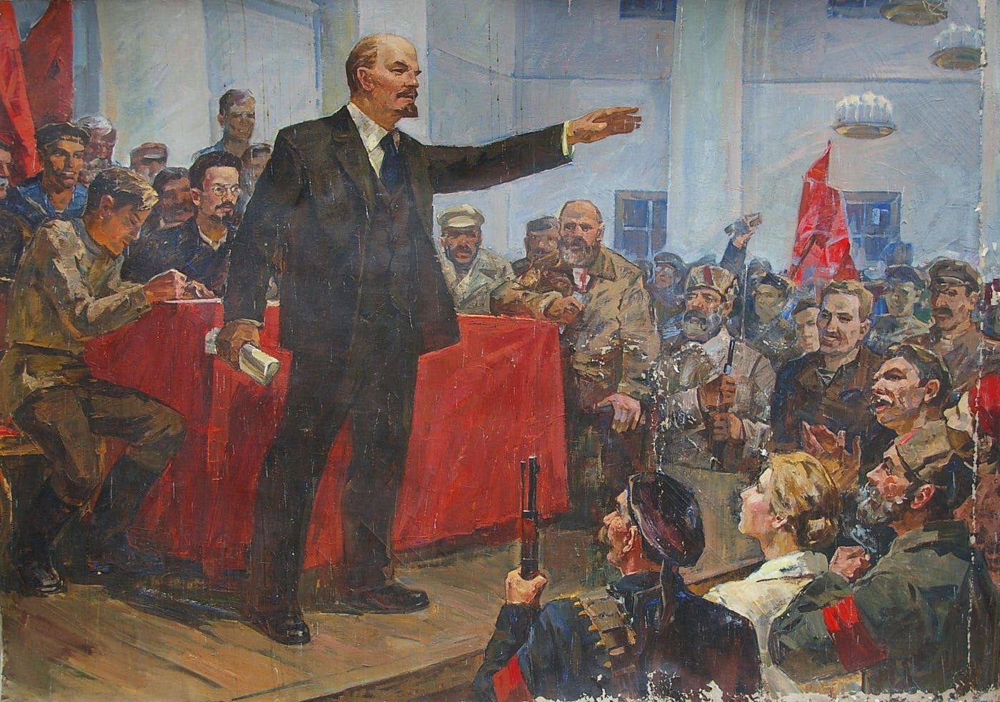

如同语言一样，金钱本身并不具备内在的道德属性。但其经济特性确实会影响道德标准——正如佛陀所教诲："金钱是人类最糟糕的发明，却是检验人性最可靠的试金石。"正当获取的金钱能激励善行，而不义之财则会诱发道德风险。要理解金钱对道德的影响，不妨设想一个生活在央行体系下的酿酒师案例：他明知央行最近通过印数万亿美元"拯救经济"使货币供应量翻倍，此时面临三个选择：

1、继续以 20 美元售价卖酒，尽管知道因通货膨胀每美元已贬值 50%

2、兑水稀释或改用廉价原料，通过降低生产成本和酒品质量来维持 20 美元售价

3、将售价提高至 40 美元，使葡萄酒在通胀后的美元计价体系中保持原有价值

为简化分析，我们将忽略通货膨胀在时空分布上的不均衡性。

若酿酒师选择第一种方案，他将承受 50%的损失。若选择兑水稀释，则是在用劣质产品欺诈消费者。若为保持品质而加倍售价，又可能因其他不诚实的竞争对手降低品质而流失客户。由于兑水行为难以被普通消费者察觉且能快速获利，通货膨胀来临时所有酿酒商都面临强烈的欺诈诱惑（这正是葡萄酒行业丑闻的根源）。同理，货币通胀会诱使各行业商家欺骗顾客，如同将盗窃的恶念植入商贩心中，迫使其在财务利益与道德操守间艰难抉择。就此而言，通胀是侵蚀社会道德体系的传染病，而抗通胀货币正是治愈道德沉疴的良方。在这个（至关重要的）意义上，比特币——作为终极通胀率为零的唯一货币——正是根治世间诸多道德顽疾的良药。

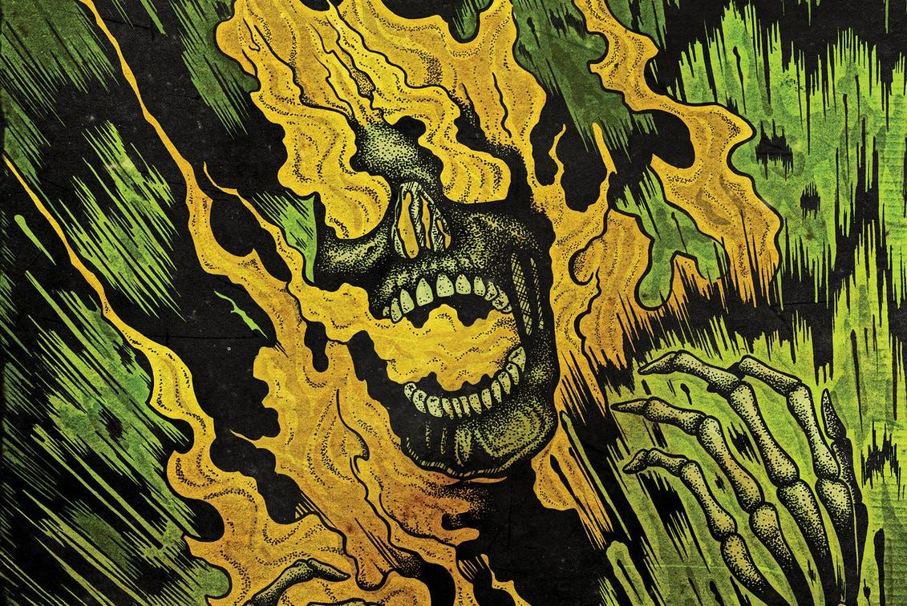

金钱是巨大诱惑的源头，因为它本质上就是"资产归属清单"，根据定义可以用它在市场上购买任何东西。当某个特权集团（垄断者）能够凭空创造货币时，他们就能任意篡改这份"资产清单"，并且有强烈的动机为自己谋利。这种"货币即产权账本"的视角，揭示了中央银行存在的根本动机——这个机构自封为"清单主宰者"，通过特权为其私人股东谋利，甚至不惜让其他所有人都沦为奴隶。

由于市场上所有商品都需要耗费人类时间才能生产（即便是土地也需要人力来销售），我们可以说金钱就是人类时间的象征。就像股票凭证代表对公司资本的拥有权一样，金钱代表着对人类时间的支配权——人们付出时间赚钱，再用这些钱换取他人等量的时间付出。显然，这种能够支配人类时间的工具极具诱惑力，因为它是强大的力量源泉（物理学将力量定义为功与时间之比）。对权力的渴望是大多数战争的动机——通常表现为试图强行夺取资本、食物或领土。而缺乏权力与不幸密切相关，这使得权力集中极具吸引力——正如斐洛所言：

"「没有奴隶是真正快乐的，因为还有什么比对自己乃至周遭一切都无能为力地活着更悲惨呢？」"

货币始终是人类主权与奴役观念的核心要素。当它经由自由市场自然选择时，便成为集体理性的结晶——个体自主意志的综合体现。但自然货币已被人为暴君所劫持：当今所谓主权国家之所以得名，完全是因为它们垄断了人类自由选择的货币——黄金。

### 所谓主权国家

"直到发现自己想做的事处处受限，我才明白自己原来是个奴隶。"——弗雷德里克·道格拉斯

五千余年来，贵金属因其完美具备可分性、耐久性、便携性、可辨识性和稀缺性这五大货币特性而备受青睐。黄金之所以脱颖而出，在于它是所有货币金属中最稀缺的。稀缺性堪称货币最重要的属性——若缺乏供应量的硬约束，总会有人禁不住诱惑增发货币，窃取其中储存的价值（参见阿格里珠、帕诺斯布币或当今法币）。

政府历来都会干预货币市场，通过掌控铸币权和仓储业务来提升货币的可分割性、便携性和辨识度——具体手段包括发行标准化硬币或仓单凭证。通过垄断这类"信用背书"业务，国家将交易双方的信任成本转嫁到了自己身上。纵观历史，各国政府始终将货币（金银币或条块）和货币替代品（纸质仓单）的价值认证（成色与重量）视为其专属职能。切记：垄断经营会阻断自由市场形成的真相发现机制，正因如此，对任何垄断机构的信任最终都会土崩瓦解。

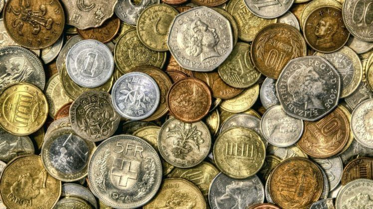

各国货币最初都是以纸质凭证的形式代表真实货币。如今这些货币已无法兑换成实物货币，转而演变成永不兑现的承诺——即法定货币。政府强制要求社会（对集体理性的限制）使用这些货币替代品进行交易，并垄断操纵货币供应的特权，以此从公民身上汲取财富（即窃取时间）。实际上，法定货币就像没有抵押品的债务，在强制社会使用的同时正经历着缓慢违约。而中央银行始终在囤积真正的货币——黄金，并继续使用这种经自由市场选择的真实交易媒介进行最终结算。

从这个角度看，"印钱"实际上指的是货币造假——生产虚假承诺，因为货币不再与真实财富挂钩。简单来说：法定货币就是一个活生生的谎言。无论你将其视为工具还是武器（取决于使用者的主观意图），操纵货币供应客观上只对一件事有用：制造财富不平等（通过窃取时间）。正如 G. Braschi 所说："每件工具都是武器（只要握法得当）"。作为意志较量中获取优势的手段，货币造假就是一种武器。

战争时期，交战国曾试图伪造敌方货币以引发恶性通货膨胀。例如，纳粹德国计划用假钞轰炸英格兰以破坏其经济。而在日本帝国时期，登户研究所曾将伪造货币作为经济颠覆策略进行实验。和平时期，货币发行权专属于中央银行，其"扩张性货币政策"每年增加约 7%的货币供应量——即通过货币发行操作，每年仅窃取美元持有者 7%的财富(即时间储蓄的积累)。

当然，当市场环境变得过于不确定时，参与者自然会回归到实物黄金这种信任最小化的选择。因为货币替代品（充其量）只是未来获取货币的承诺，存在违约风险。与法定货币不同，黄金是集体理性的体现，而非交易对手的强制要求。那些自诩"主权"的国家，其商业模式正是建立在没收金银等自主货币之上的。黄金卓越的货币属性使其成为人类历史上最具价值的自主货币形式，这种统治地位自古埃及建立之前便已确立。

### 吉萨大金字塔

"征服和奴役一个国家有两种方式：一是用剑，二是用债务。——约翰·亚当斯"

古埃及在圣经中被视为专制暴政的典型代表。埃及以宏伟的金字塔闻名于世，这些巨石建筑都是建立在奴隶的血泪之上。事实上，这些建筑的辉煌成就很大程度上要"归功于"被法老——古埃及的统治者——剥夺了生命的无数奴隶。若要略微理解建造一座大金字塔的艰辛程度，不妨看看威尔·杜兰特在《历史的英雄》中引用的这个数据：

"据希罗多德记载...仅建造金字塔本身就动用了 10 万人力，耗时二十年。"

为了更精确地量化埃及奴隶被窃取的时间，我们再次假设每名奴隶每年从事体力劳动 5,000 小时，10 万名奴隶持续建造 20 年，相当于被窃取了 100 亿小时。在建造一座大金字塔的过程中，这个惊人的工时数字揭示了人类被束缚在残酷肉体奴役中的代价——但（可悲的是）仍不及人类史上最大庞氏骗局所窃取的时间：法定货币体系。正如亨利·福特所预言：

"如果美国人民真正了解我们的银行和货币体系，我相信明天天亮前就会爆发革命——幸好他们永远都不会懂。"

金字塔骗局是一种基于多层次网络营销的投资骗局，上层参与者通过剥削下层获利。法定货币就是央行建立的金字塔骗局——他们限制黄金流通并压制金价，因为黄金具有可靠稀缺性且能长期保值，若在自由市场流通必将击败劣质法币。各国通过法定货币法和税收政策强制推行法币。全球最流行的货币竟是骗局或许难以置信，但美元符号体系已说明一切：

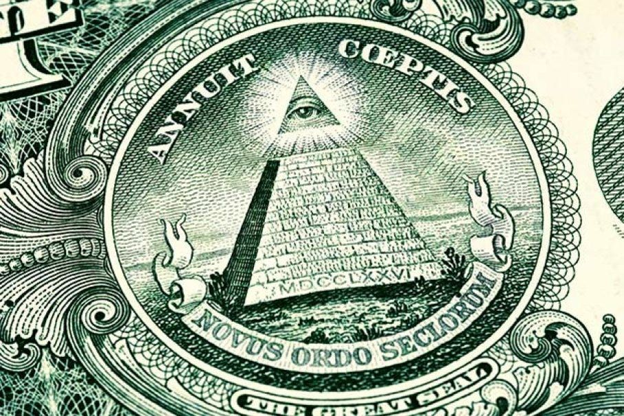

经过政府长期精心设计的金融戏法后，这些金字塔骗局最终主宰了世界。法定货币是由央行控制的债务型货币替代品，它们通过强制或暴力手段（类似格兰帕拉和马拉尼昂公司的做法）将这些货币网络强加给使用者，并压制市场上所有竞争。最可耻的是，社会中最贫困的群体——他们（出于生存需要）将大部分财富以法币形式持有——反而成为这个欺诈体系的最大受害者。

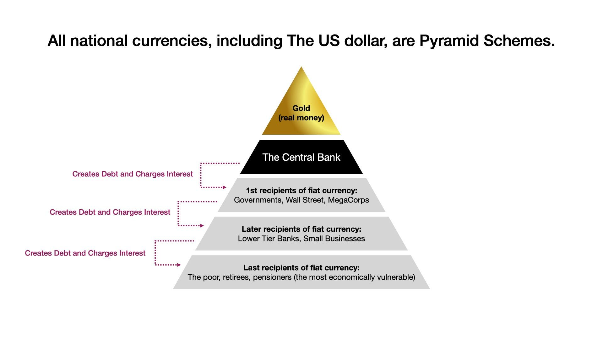

位于法币金字塔骗局顶端的正是黄金：这种被历史上无数企业家通过自由选择的累积（集体意志）筛选出来的货币技术。纸质货币作为黄金的抽象表征被引入，本意只是为了便于交易流通，而非取而代之。随着时间推移，纸币兑换黄金的选项被逐步取消，使政府完全掌控了货币稀缺性，从而获得通过操控货币供应来无限掠夺公民财富的能力。

实际上，每当新发行一单位法币（央行美其名曰"量化宽松"或 QE），这个金字塔骗局就会自上而下新增层级，通胀成本则转嫁给用法币储值的人群。更恶劣的是，每单位法币都经过杠杆放大——当其进入广义货币供应时，实际规模已膨胀数十倍。以美联储为例：在扣取运营经费和向不公开股东派发 6%年化分红后，该机构就用新印的美元购买美国政府债务。这些刚印出（更准确说是电子生成）的法币，随后任由政府官僚支配——他们（毫不意外地）往往偏袒资助其竞选的银行家、企业和说客。这种财富从穷人向权贵转移的机制令人不齿（罗宾汉都要蒙羞）。

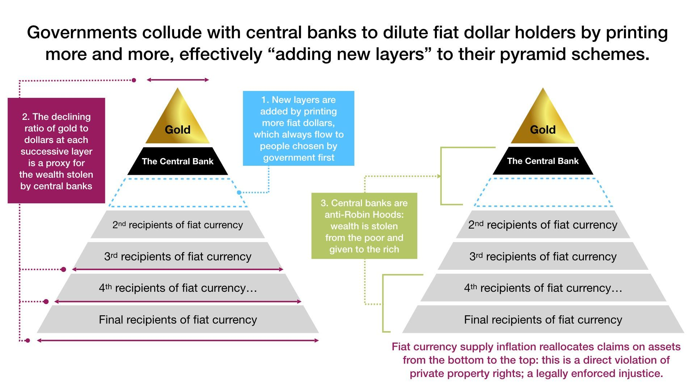

只要人们保持足够的被动性却又具备生产力，这种金字塔骗局就能越建越高，继续作为政治操盘手们掠夺财富（窃取时间）的工具运转下去。然而天下没有免费的午餐，这种法定货币的供应扩张不可能永远持续。随着一轮又一轮量化宽松不断堆积层级，人们通过物价膨胀被隐性征税的程度越来越重，对货币的信任就会逐渐削弱。正如海明威形容破产那样，这个过程起初是渐进的，但当通胀演变为恶性通胀时就会突然爆发：经济活动中原本赖以维系的货币信用将彻底崩塌。至此，"央行主宰者"对其"法币奴隶公民"的压榨已超过极限，民众最终被逼至经济生存线的边缘。

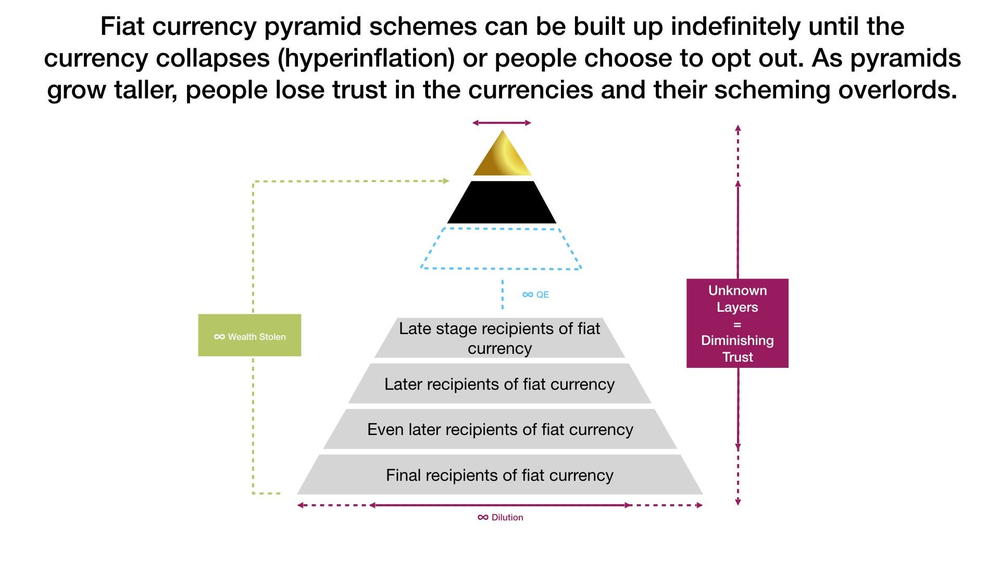

幸运的是，由于比特币的存在，这些金融金字塔骗局再也无法像黄金那样躲避直接竞争。所有法定货币都极度依赖央行压制竞争的能力——这种压制阻断了可能戳破货币幻觉的市场发现过程。央行掌握全球 20%黄金储备使其能对金价施加重大影响，它们通过纸黄金市场持续压制金价。若不加干预，当人们始终青睐能随时间保持购买力（通过稀缺性维持）的货币时，法定货币将在黄金这种更优越的货币形态面前迅速崩溃。就此而言，比特币——全球唯一的"数字黄金"——实现了重大突破：这项货币技术既能颠覆黄金体系，又可抵御央行竞争压制，更是人类对绝对稀缺性的一次终极发现。

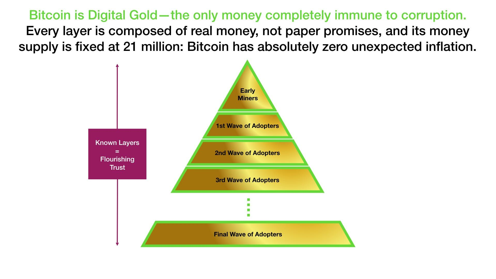

所有货币都呈现出多层次营销的估值动态：对于比特币而言，早期采用者通过预见他人后续入场而获得不成比例的收益（比特币的经济启动过程呈现出良性循环特征）。但与法币金字塔骗局中不可知的供应量不同，比特币的总量是举世皆知的。对于法币而言，"早期采用者"永远是那些掌握印钞机的人；这种地位不对称（政治特权）使得游戏规则有失公允。

比特币采用更为对称的系统，其独特之处在于具备完全信息透明性——这意味着所有市场参与者都能看清其运行规则，验证总量永不超 2100 万枚的设定，并精准掌握每枚比特币的产出时间。在这个体系中，所有未被预见的供应通胀都被优化至绝对零值，完全利好持币者。完全信息透明是经济学中"完全竞争"概念的前提条件：这种理想化（却难以企及）的市场状态下，竞争力完全不受冗余监管束缚，财富创造达到最大化。比特币的重要愿景正是通过实现货币与政权的分离，推动全球市场向这种经济理想状态靠拢。

这座由"数字黄金"构筑的金字塔，以永恒的层级结构傲然矗立，其光芒盖过了法币与生俱来的不确定性。既然货币本质是"对抗不确定性的保险"，人们对其需求必然聚焦于货币属性的相对确定性——而比特币完美优化了所有五大属性：它既具备纯粹信息的可分割性、持久性、便携性和可识别性，又拥有时间铸就的稀缺性。如同死亡与纳税般无可辩驳，"2100 万枚比特币"的总量恒定已成为不证自明的真理。这种数字化的绝对稀缺性、防盗窃特性，加上抢先布局的逐利动机，使比特币形成了全球市场无法逃脱的博弈论引力场。颇具讽刺意味的是，正是这种无法逃避的特性，正在让全世界越来越多的"法币奴隶"获得解放。

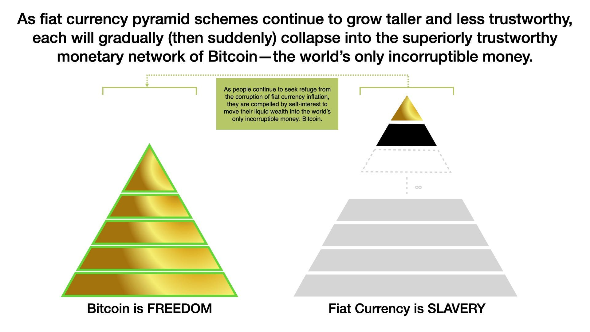

如图所示，比特币货币金字塔因其固定高度展现出绝对稀缺性，随着法币金字塔通过增发不断增高且可信度降低，比特币的竞争优势日益凸显。最终这些"纸牌屋"终将崩塌，完全暴露在比特币的透明确定体系之下。无论市场参与者是否理解，在货币领域，已知的事物始终是抵御未知的保障。

从这个角度看，世界终于迎来了值得期待的改变——我们拥有了完全可预测的货币体系，这种抗腐败的机制彻底颠覆了缺乏伦理的中央银行体系。比特币是诚实货币，将世界从法币的谎言中解放出来。从形而上学的角度看，比特币或许正是古代炼金术士数个世纪以来追寻的"哲人石"——那种能够净化世间腐败的不朽物质。正如乔丹·彼得森在其著作

[《意义的地图》](https://www.amazon.com/Maps-Meaning-Architecture-Jordan-Peterson/dp/0415922224)

中对炼金术的阐述：

炼金术转变的序列与基督受难平行，与英雄及其救赎的神话平行。炼金术的核心信息是：个人对暴政的拒绝，自愿追求未知而可怖的事物——基于对理想的信念——可能引发如此震撼的个人转变，以至于唯有最深奥的宗教神话才能与之匹敌......哲人石是"转变的媒介"，等同于神话中救赎的英雄——能够将"贱金属转化为黄金"。正因如此，它比黄金更有价值——就像英雄比他任何具体成就更有价值一样。

炼金术可视为"前科学"——这种延续数千年的实验性探索，为后世科学方法奠定了基础（连牛顿都曾是炼金术士）。作为思想流派，炼金术是从教会体系"分叉"而出的异端学说，其核心理念认为救赎之道藏于自然实验室中（在当时实属离经叛道）。比特币站在人类技术成就的最前沿，作为唯一具有防篡改供应特性的货币，它正深刻改变着信仰者的生活。或许比特币正是炼金术士追寻数百年的"贤者之石"——这种不朽的物质既能反抗暴政，又能让人类更接近神性。比特币即真理，而根据某种定义，上帝就显现在那些能矫正病态等级制度的真言之中。正如本杰明·富兰克林所言：

如同自由、爱与真理一般，上帝是永恒的。这里我说的不是"天上那位"——创世纪中的古老理念认为，上帝是以勇气、真理和爱直面混沌潜能，将其转化为良善有序的力量。我们作为按上帝形象所造的个体，都被赋予了"逻各斯"这种自我生成的力量，使我们能够和谐地重构自然世界，创造美好宜居的空间。未来孕育于我们的想象之中，通过自由运用思想、言语和行动中的逻各斯，我们就能召唤这种现实。逻各斯是存于每个人内心的神圣火花；虽然言语永远无法完全触及灵性真理，但我们仍可以说：上帝是永恒贯穿所有生命的反熵法则。正如切斯特顿所言：

若要最真实地体现个人内在的逻各斯神圣法则，并集体更接近上帝的永恒性，我们必须战胜那些持续暗中窃取我们时间的邪恶力量。

### 时间窃贼

"法律对一种强盗束手无策，他们窃取人类最宝贵的东西：时间。"——拿破仑·波拿巴

许多人错误地将世界上的诸多经济问题归咎于资本主义。然而，每个现代经济体的核心都存在着一个社会主义机构：中央银行。从原始意义上说，第一个挖洞避雨的人是第一位资本家，而第一个为私利暴力侵占他人领地的人则是第一位社会主义者。资本主义的本质很简单：每个人都对自己劳动成果拥有专属权，换言之，每个人都拥有自己的时间。真正的资本家可以自由交易他们投入时间创造的价值（商品、服务或知识），与其他同样自主的人进行交换。而社会主义则意味着政府（即其他人）或多或少占有你的时间——他们通过征兵、征税和通货膨胀等手段获取的"那一磅肉"。

社会主义法币是国家暴政的命脉：要理解央行系统通过窃取时间变得多么庞大，让我们仔细看看美联储。根据社保局的年度工资数据、美国 M2 货币供应量变化，并假设每位工人年均工作 2000 小时，我们得出惊人数据。用美元供应量增长除以当年平均时薪，就能计算出通过 M2 扩张从社会窃取的时间当量（来源

[链接](https://www.dropbox.com/scl/fi/t7e4rcku16oblo0e5jv0y/US-M2-and-Hours-Stolen-since-1981.xlsx?rlkey=flbuu7mq8kq8njnmdgjifb2f5&e=1&dl=0)

）。

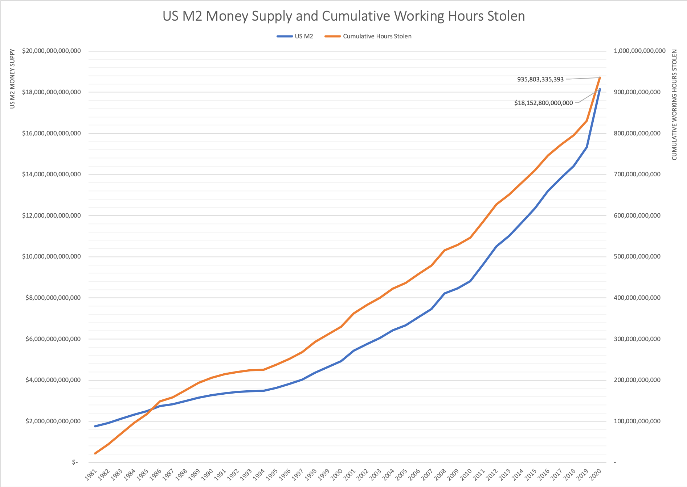

自 1981 年以来，美联储官僚每年平均窃取 7.6%的工作时间，从勤劳民众身上榨取了近万亿工时。按每人年均工作 2000 小时计算，这相当于连续 40 年奴役 1170 万人。这种通过通胀实现的隐性征税，还要叠加美国政府征收的所有显性税收——全都是赤裸裸的社会主义行径。除非交易由自愿的市场参与者达成，否则就是敲诈勒索——这是自由市场资本主义的核心原则。

美联储每年窃取的时间比跨大西洋奴隶贸易多 341%。每年 234 亿工时的掠夺量，理论上足够美联储每年建造 2.3 座金字塔。就每年窃取的人类绝对时间而言，法币制度堪称人类史上最大的庞氏骗局和奴隶制机构。

当我们不再将中央银行体系视为经济学叙事，而是开始将其看作犯罪故事时，才真正触及了本质真相。资本主义建立在真实之上（勤奋工作、延迟满足与诚实交易），而社会主义则构筑于谎言之中（官僚主义、宣传机器与巧取豪夺）。就像伪造的阿格里珠串和帕诺布，伪造的美元同样被用于军事动员——在法定货币出现前，这些行动必须通过公开征税或借款来筹措资金。社会主义货币是邪恶的隐形资金来源：人类历史上每个独裁政权、世界大战和集中营背后都有它的影子。仅 20 世纪，法定货币支撑的政府就屠杀了 1.69 亿人——这种现代超级暴行被称为"政权屠杀"：

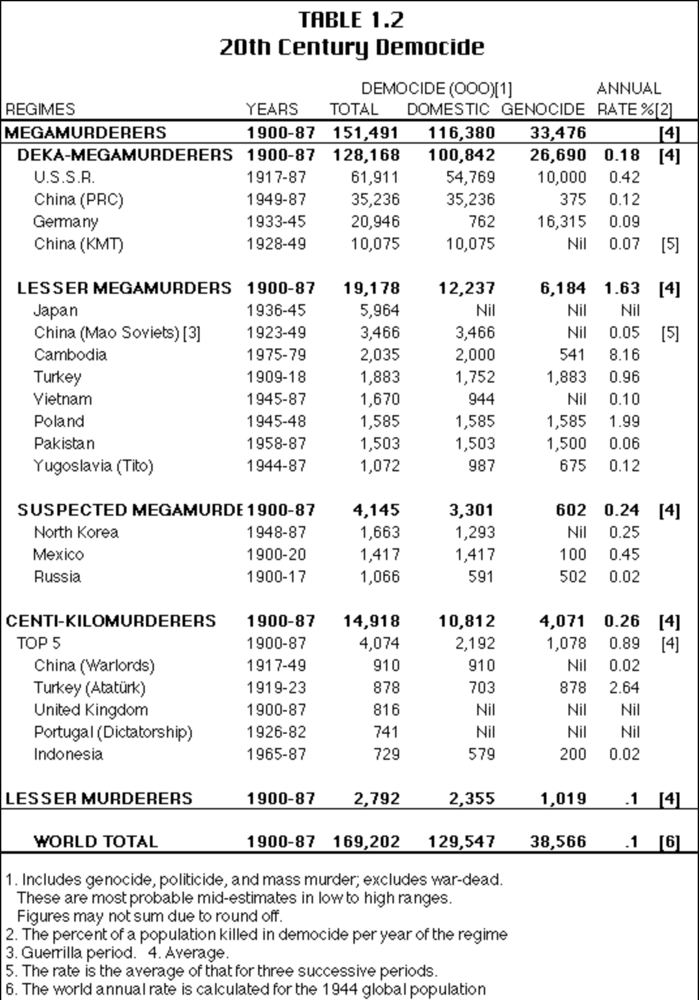

历史已昭示：全球范围内强制推行法定货币谎言，导致生命以骇人规模消逝。简言之：社会主义即欺诈，而对中央银行真相保持沉默者，皆为共犯。正如纳西姆·塔勒布精辟阐述的这一伦理准则：

货币中央计划并非新概念。马克思在 184 年《共产党宣言》第五条纲领中明确写道："通过国家银行将信贷集中于国家手中，实行国家资本垄断"。央行制度完全照搬马克思剧本，与资本主义毫无瓜葛——它本质上是反资本主义的组织。让我们直言不讳：中央银行就是货币社会主义，是金融奴役的工具。更甚者，马克思本人是公认的种族主义者，其设计的央行社会主义体系根本目的就是榨取被国家认定为"劣等族群"的财富。难怪这个以马克思主义哲学为核心的机构，最终会异化成种族主义奴隶主。

奴隶主企图窃取劳动成果却不愿付出必要牺牲。纵观贸易社会，黄金之所以成为首选货币，正因获取它需要"工作证明"：这种无法伪造的高昂成本使其天然成为集体牺牲的具象化象征。劳动是崇高的事业，它让我们更接近永恒的上帝——因为所有创新本质都是提升生产率，让我们在相同时间内创造更大价值。偷窃则恰恰相反：这是对现实道德准则的扭曲，只为满足私欲而忤逆永恒之神。任何扭曲现实的企图终将反噬作恶者，唯有真理能让我们免受欺瞒之害。

事实上，货币是一种社会契约，它让我们牺牲当下时间以换取未来享受。债务则是透支未来享受当下的产物。真正的货币应是债务的终极清偿者。而法定货币与货币本质自相矛盾——它本身就是借债产生的。因此，以法币为燃料的经济体已饕餮债务逾百年，清算日近在眼前：经济规律要求兑现延期偿付的代价——这正是各国政府如今（道德与财政）濒临破产的根本原因。

作为社会契约的核心要素，我们今日服务社会的时间必须能兑换成未来对等的社会服务。当暴政通过通胀掠夺社会、破坏这种跨期信任机制时，社会就会走向分崩离析。法定货币实乃世间至恶工具：它是狡诈奴隶主用来实施代际掠夺的武器，受害者却浑然不觉。

### 现代奴隶主

"「身为穷人固然艰难，但在美元帝国沦为贫困种族，才是苦难的至暗深渊。」——W.E.B.杜波依斯"

主从关系的本质几乎总是带有种族或文化色彩，这一事实即便在我们当今这个"文明"时代也未曾改变。近年来美国频发的警察暴力事件，其矛头大多指向非裔美国人。而最近这起警察施暴案件，似乎成了压垮骆驼的最后一根稻草——社会早已对层出不穷的非裔遭警察伤害事件忍无可忍。2020 年 5 月 25 日，46 岁的父亲、朋友、兄弟乔治·弗洛伊德，被一名州警当街杀害。警察用膝盖抵住弗洛伊德的脖子，在光天化日之下实施了长达九分钟的慢动作谋杀，围观民众却只能无助地目睹这一切。

请记住：真理是所有探索的终点。在数字时代，认知的窗口呈指数级增长，将探索之光折射出多彩交织的图景。这种数字化生存的多维视角，犹如助燃剂般加速自由市场对真相的发掘——想想数字技术在阿拉伯之春、维基解密事件中的作用，以及如今席卷全球的乔治·弗洛伊德抗议活动。1965 年，当马丁·路德·金在阿拉巴马州领导抗议投票不公时，警察暴力镇压了游行群众。虽然类似事件此前屡见不鲜，但这次被电视直播——正是这个关键差异改变了历史进程。当全世界实时目睹警察残暴对待和平示威者后，美国政府很快被迫通过法案，废除了种族隔离与歧视制度。

自由市场资本主义是一种社会体系，它通过尽可能多的视角（通过语言和价格）来观察世界，从而获得对现实的高清认知。在数字时代，市场的这种多元视角因智能手机、社交媒体和直播技术而得到放大，从而进一步唤醒了我们的集体意识。事实上，像乔治·弗洛伊德这样的悲剧事件长期都在发生，但通过社交媒体的传播，他的遭遇引发了全球对警察暴行的抗议。在过去，此类谋杀案件较少受到关注，但在现代社会，一个人的遇害可能在全球引发一场"法定奴隶起义"。乔治·弗洛伊德遇害事件在社交媒体上如野火般蔓延，并演变成席卷全球的抗议浪潮，这证明了数字技术对真相探索之光的折射效应，进而影响真相的发现。

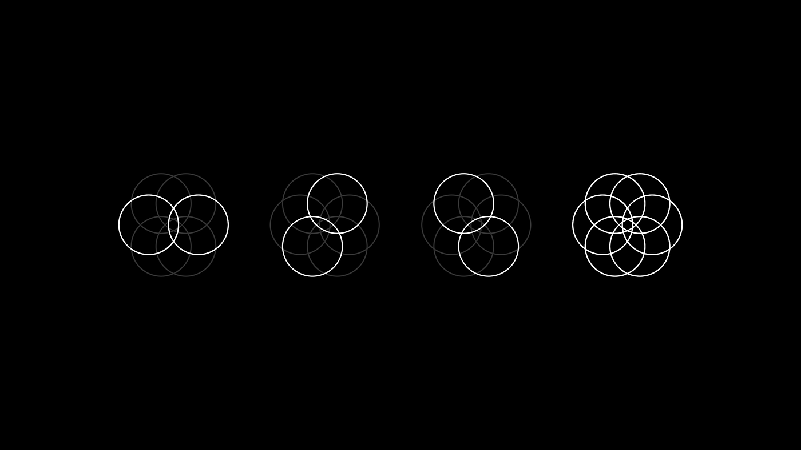

事实上，警察是政府"财产"的守护者：他们的职责是在国家持续从法定奴隶身上榨取利益时"维持秩序"。美国南部许多城市的警察部门最初就是作为

[奴隶巡逻队](https://plsonline.eku.edu/insidelook/brief-history-slavery-and-origins-american-policing)

成立的，任务是协助地主追捕和惩罚逃跑的奴隶——从而维护奴隶主的"财产权"。即使在今天，警察的工作仍是通过为法庭收集信息来调查犯罪，而非保护公民的生命。正如那句格言所说："占有即法律的十分之九"，显然警察——这群军事化的事实调查者——说白了不过是美化版的政府打手罢了。

真相之光终将消融谎言：这正是央行体系必然崩溃的原因——它本质上依赖无知、恐惧与压制自由选择；在数字时代无处不在的审视目光下，这种制度注定无法存活。当知识获取达到前所未有的便捷时，这种集中化的伪钞制造体系终将被时代唾弃。乔治·弗洛伊德遇害前，仅因使用一张 20 美元假钞被捕：而美联储却以万亿规模实施着完全相同的罪行。百万、十亿、万亿：这些数字说起来轻巧，但国家主导的伪钞工程实际规模远超常人想象。可视化图表能帮助我们理解：

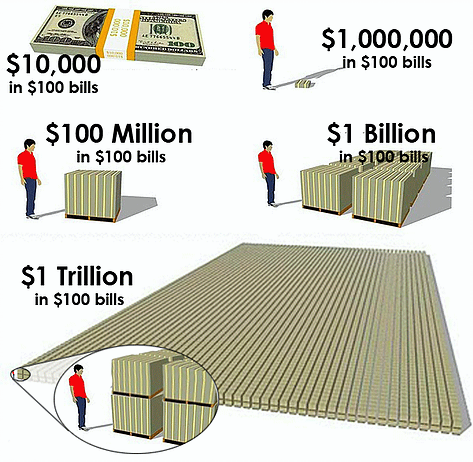

每一张印制的美元都是被窃取时间的证明——美国国债可视化图表让我们直观感受到，这种制度化窃取时间的央行体系已膨胀到何等惊人的规模：

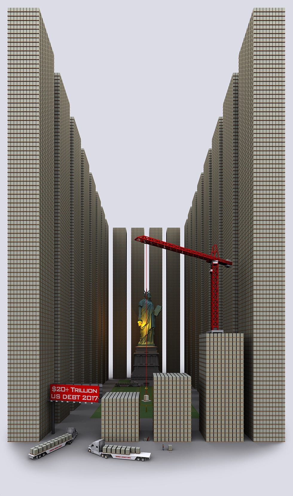

请记住：当特权阶层能够以比其他人更低的成本制造货币时，社会就会不断滑向奴役的深渊。因此，在中央银行体系被废除之前，真正的自由世界永远遥不可及。

既讽刺又可悲的是，乔治·弗洛伊德被迫使用 20 美元假钞，其根源正是美联储大规模伪造美元的现实。这再次证明货币的经济属性直接影响道德标准：法币金字塔骗局建立在盗窃证明之上，迫使人们通过寻租、偷窃和欺骗来维持生计。通货膨胀对最贫困群体的打击最为严重，这解释了为何当代美国黑人家庭的中位财富（1.7 万美元）不足白人家庭（17.1 万美元）的 10%，且差距仍在扩大。正如迈克尔·克里格所描述的，这种基于债务货币的系统性武器化正在持续发酵。

"这种做法非但没有赋予人们力量，反而将他们变成了现代版的契约奴工，像仓鼠一样被困在永无止境的转轮上，几乎看不到脱身的希望。这绝非偶然，而是一种经过反复验证的工具——当它与铺天盖地的媒体宣传相结合时，就能有效制造出顺从、迷茫且绝望的底层阶级。"

购买比特币就是在参与一场全球性的抗议，对抗国家操控的货币金字塔骗局，这种方式让政客们无法忽视——因为金钱是唯一无法被消音的投票系统。

虽然我们无法选择自己的出生国度，但感谢中本聪让我们都能自由选择自己的货币。这条道路的第一步是自我教育：公立教育课程刻意回避货币起源和运作原理绝非巧合。值得庆幸的是，只要找对方向，互联网就是知识的宝库。

自由市场本质上是一场探寻真理的经济博弈，而市场操纵者就是作弊的骗子。从这个角度看，美联储就像职业运动队，只需按下按钮就能轻松得分——这支恶意队伍根本不屑遵守我们共同的游戏规则。面对如此"不可战胜"的对手，市场其他参与者难免士气低落，因为他们无论表现多出色都难逃被收割的命运。金钱游戏关乎生死存亡，它牵涉到人类最根本的自由权益。简言之：货币造假即奴役。比特币正在打破央行对货币的垄断，为深陷法币桎梏的世界带来解放的曙光。

### 逐光而行

"「我祈求自由二十载未得回应，直到我用双腿去祈祷。」——弗雷德里克·道格拉斯"

在星光璀璨的夜空下匆忙赶路，在坚定的废奴主义者帮助下，南北战争前南方的逃亡奴隶们冒着巨大风险北上，试图逃往加拿大自由州。寻找正北方向有时颇具挑战，幸运的是有许多线索——比如树木北侧生长的苔藓，或是候鸟北迁的飞行路线——都能帮助逃亡奴隶追寻自由。这些线索中最关键的当属北极星，与其他天体不同，它永远固定在夜空中的位置。

在夜幕掩护下悄然行动，这些勇敢的前奴隶们依靠北极星的恒定方位，照亮通往自由的道路。在极度危险的处境中前行，时刻面临信任危机，这颗天穹火炬——真正的指路明灯——成为了"地下铁路"的航标：这个由秘密路线和安全屋构成的网络，为逃亡的非裔美国人提供了通往加拿大的安全通道。哈丽特·塔布曼等反奴隶制活动家支持着这个由志愿者组成、灵活机动的秘密网络，它在瓦解内战前美国严酷的奴隶制度中发挥了关键作用。

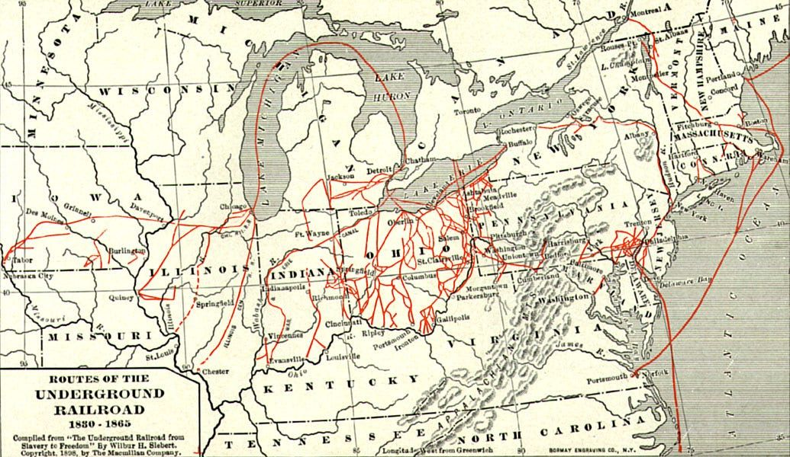

当今时代，我们再次看到了摆脱美联储强加的金融奴役的希望——那是一个由志愿者编程、开源且加密隐秘的网络系统，它遵循着自己"北极星"般的准则：2100 万枚永不增发的比特币。对逃亡的非洲奴隶而言，高悬天际、超越奴隶主报复范围的北极星是上帝的恩赐：那是永不熄灭的自由之光。比特币——这种总量严格限定在 2100 万枚的自由市场货币，正是寻求逃离央行控制经济的法币奴隶们永恒的指路明灯。比特币的全球普及，将一劳永逸地实现人类从央行枷锁中的解放。

我们都在亲眼见证不可阻挡的诚实货币如何焚毁制度性的谎言。比特币是吞噬全球法币虚构体系的真诚烈焰。从这场凤凰涅槃般的焚毁中，一个建立在问责、荣誉与诚信健全原则上的社会正在崛起。作为绝对真实货币的实践，比特币是无法被胁迫或隐藏的璀璨明灯。正如佛陀所教诲的：

比特币是对自由世界最强大的社会主义堡垒——中央银行的反叛。这是一场和平革命，旨在永久解除那些将货币武器化以掠夺财富的暴君武装。比特币是用于刺杀时间窃贼的和平武器。作为一种炼金术原型，它是国家腐败和社会道德沉疴的解药。作为纯粹诚实的自由市场货币，比特币是不可压制的真相，是纯粹货币资本主义的体现，也是现代全球法币奴隶的独立宣言。

比特币是无主之币：一个由规则而非统治者管理的体系。通过唤醒世界摆脱金融奴役的噩梦，比特币正在将自由梦想变为现实。